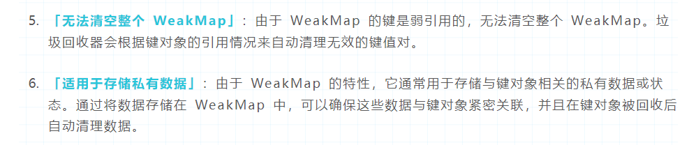

# Q: weakMap的特性

> https://juejin.cn/post/7377635432967192585?searchId=20240625144539D492C5A1A8A655BF4815

## Set Map

Set和Map是ES6新增加的数据类型。其中Set被称作“集合”，Map被称作“映射”。新增的这两个数据结构提供了更灵活和强大的方式来处理和存储数据。

Set的特点：Set成员的值都是唯一的，不允许重复。

| 常用方法             |               |
| -------------------- | ------------- |
| 初始化Set对象        | new Set()     |
| 添加指定元素         | add(value)    |
| 是否存在指定元素     | has(value)    |
| 删除集合中的指定元素 | delete(value) |
| 清空集合内所有元素   | clear()       |
| 集合中元素的数量     | size          |

## WeakSet WeakMap

WeakSet和WeakMap都是弱引用，首先了解一下什么是弱引用。

弱引用不能确保其引用的对象不会被**垃圾回收器**回收，

而强引用是确保其引用的对象不会被垃圾回收器回收。

- **WeakSet**

WeakSet和Set非常相似，但是有一些不同之处：

1. 成员类型：WeakSet的成员只能是Symbol值和对象，不能是其他的数据类型；Set的成员可以是任意数据类型。
2. 引用类型：WeakSet是弱引用；Set是强引用。
3. 方法和属性：WeakSet不支持迭代，所以没有`forEach`, `values`, `keys`, `entries`方法，并且也没有`size`属性；Set有`forEach`, `values`, `keys`, `entries`方法，也有`size`属性。
4. 作用：WeakSet可以实现自动清理回收；Set可以通过元素的唯一性用于实现去重工作。

**总结：成员必须是对象、弱引用特性、不支持迭代、无法获取长度、适用于去重工作**

- **WeakMap**

WeakMap和Map也非常相似，但是也是有一些不同：

1. 键的类型：WeakMap的键类型只能是对象和Symbol值；Map的键类型可以是任意数据类型。
2. 引用类型：WeakMap是弱引用；Map是强引用。
3. 方法和属性：WeakMap不支持迭代，所以没有`forEach`, `values`, `keys`, `entries`方法，并且也没有`size`属性；Map有`forEach`, `values`, `keys`, `entries`方法，也有`size`属性。
4. 作用：WeakMap也可以实现自动清理回收；Map提供需要高效键值对的操作。

总结：**键必须是对象**、**弱引用特性**、**不可迭代**、**无法获取长度**、**无法清空整个 WeakMap**、**适用于存储私有数据**

