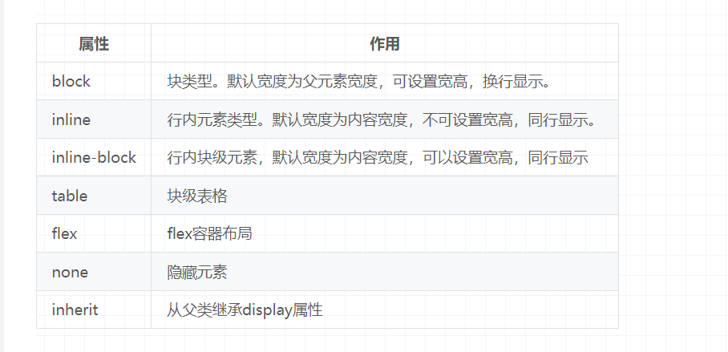

# HTML

## src和href的区别

> https://juejin.cn/post/7269794410573512758

`src`和`href`都是用来加载外部资源，区别如下

**src**当浏览器解析到该元素时，会暂停其他资源的加载和处理，直到该资源加载完成。 它会将其指向的资源内容嵌入到当前标签所在的位置。常用在`img`、`script`、`iframe`等标签。

**href**指向外部资源所在的位置，和当前元素位置建立链接，当浏览器解识别到它指向的位置，将其下载的时候，不会阻止其他资源的加载解析。常用在`a` 、 `link`标签。


src解析停嵌入，

href指位置，建链接，不阻止

## HTML5新增特性

新增语义化标签，`head`、`footer`、`nav`、`main`、```aside```、`section`等

新增表单类型属性，`email`、`number`、`时间控件`、`color颜色拾取器`、`placeholder`、`autofocus自动获取焦点...`

新增音视频标签，`video`、`audio`

新增`canvas`画布和svg

新增了即时通讯`websocket`

新增本地存储`localStorage`、`sessionStorage`

新增了地理定位 Geoloaction :定位用户位置的技术

新增了拖拽API ，Drag and Drop


> 语义 表单 音视频  画 通讯 存储 地理 拖拽
>
>  义 单 频 通 画，存储地理拖 （外卖小哥）

## 对HTML语义化理解

根据内容来选择合适的标签

- 方便浏览器爬虫更好的识别内容。
- 有利于代码可读性，开发者能清晰的看出网页的结构，便于团队的开发与维护。

> 根据内容来选择合适的标签
>
> 虫识别，码可读，人维护

## DOCTYPE(⽂档类型) 的作⽤

`DOCTYPE`是HTML5中一种标准通用标记语言的文档类型声明，是用来告诉浏览器的解析器，该用什么样的方式去加载识别文档。

## iframe

`iframe`通常用来加载外部链接，不会影响网页内容的加载

**优点**

- 可以将网页原封不动的加载进来
- 增加代码的可用性
- 用来加载显示较慢的内容，如广告、视频等

**缺点**

- 加载的内容无法被浏览器引擎识别，对`SEO`不友好
- 会阻塞`onload`事件加载
- 会产生很多页面，不利于管理

> 原封加载、显示慢内容
>
> 无法识别、阻塞onload、产生页面

## Canvas和SVG的区别

svg和canvas都能在浏览器中创建图形，但是他们创建图形的根本原理是不同的。

- **canvas画布**，是通过`javascript`来绘制2d图，是逐像素进行渲染。
- **SVG矢量图**，是基于`XML`描述的2D图形语言，每个元素都是可用的，可以为其添加事件。

## script标签中defer和async的区别

他俩都是表示**异步加载外部JS脚本**，不会阻碍页面的加载解析。 **区别**

- 执行顺序：有多个`async`标签不能保证先后加载顺序，而多个`defer`标签可以按先后顺序加载。
- 是否立即执行：`async`加载完脚本后会**立即执行**，`defer`是要等**文档解析完成后才执行**。

> 异步加载外部JS脚本
>
> 执行顺序？立即执行？

## 行内元素、块级元素、空（void）

- **行内**： `a`、`b`、`span`、`input`、`img`、`select`、 `strong`
- **块**：`p`、`div`、`h1`、`ul`、`ol`、`li`、`dl`、`dt`、`dd`
- **空**：`<hr>`、`<br>`、``、`<input>`、`<link>`、`<meta>`

## 怎样添加、移除、移动、复制、创建和查找节点

> 新 增 删  查 复制 移动

- 添加节点`document.appendChild(dom)`
- 移除节点`document.removeChild(dom)`
- 移动节点`document.appendChild(targetDom)`
- 复制节点`dom.cloneNode(true)`，参数`true`表示是否复制子节点
- 创建节点`document.createElement(dom)`
- 查找节点:
  - `document.getElementById("elementId")`
  - `document.getElementsByClassName("className")`
  - `document.getElementsByTagName("tagName")`
  - `document.querySelector("selector")`
  - `document.querySelectorAll("selector")`

# CSS

## CSS3新增特性

[《CSS3新增特性》](https://blog.csdn.net/qq_44741577/article/details/136256747?ops_request_misc=%257B%2522request%255Fid%2522%253A%2522171991550516800215082616%2522%252C%2522scm%2522%253A%252220140713.130102334..%2522%257D&request_id=171991550516800215082616&biz_id=0&utm_medium=distribute.pc_search_result.none-task-blog-2~all~sobaiduend~default-1-136256747-null-null.142^v100^control&utm_term=CSS3%E6%96%B0%E5%A2%9E%E7%89%B9%E6%80%A7&spm=1018.2226.3001.4187)

- 新增CSS选择器、伪类 :hover :active
- 新增盒模型相关属性 box-sizing, resize, box-shadow, opacity
- 新增边框属性  圆角`border-radius`
- 新增文本属性  比如text-shadow文本阴影，text-decoration文本修饰
- 新增渐变 `linear-gradient`线性, `radial-gradient`径向
- `transform`变换
- `transtion`过渡
-  `animation`动画
- 伸缩盒模型flex

>  伪 盒 框 字 （何广智），GTTA，flex

## 盒模型

盒模型都是由四个部分组成的，分别是`margin`、`border`、`padding`和`content`。

标准盒模型和IE盒模型的区别在于设置`width`和`height`时，对应的范围不同。

- **标准盒模型**的`width`、`height`只包含了`content`
- **IE盒模型的**的`width`、`height`除了`content`本身，还包含了`border`、`padding`

通过修改元素的`box-sizing`属性来改变元素的盒模型

- `box-sizeing: content-box`表示标准盒模型（默认值）
- `box-sizeing: border-box`表示IE盒模型（IE盒模型)

## box-sizing全部属性

通过修改元素的`box-sizing`属性来改变元素的盒模型

content-box(默认)   border-box   

inherit 用于继承父元素的box-sizing属性值

## 选择器的优先级

内联 > ID选择器 > 类选择器 > 标签选择器。

>- 内联样式
>- ID选择器
>- 类选择器/伪类选择器/属性选择器
>- 标签选择器/伪元素选择器
>- 关系选择器/通配符选择器

## 可继承属性和不可继承属性

**可继承属性：会自动应用到元素的所有子元素上**

- `font-weight`
- `color`
- `font-size`
- `line-height`
- `cursor`

**不可继承属性：自动应用**

- `margin`、`padding`、`border`
- `display`
- `background`
- `overflow`
- `width`、`height`
- `position`

CSS3中的一些属性，如`transition`和`animation`，虽然是不可继承属性，但它们有特殊的控制行为，可以影响子元素。

## dislpay的属性和作用



> bii inft

## 隐藏元素的方式

`display：none`：元素在文档中不存在，不会占据位置。

`visibility： hidden`：元素在文档中的位置还保留，仍然占据空间。

`opacity：0`：将透明度设置为0。

`z-index`：负值：直接将元素放置在最下层，利用其他元素来遮盖。

`position：absolute`：将元素定位到可视区域以外

dvozp

## 单行、多行文本溢出

单行

```
overflow: hidden; // 溢出隐藏
text-overflow: ellipsis; // 溢出用省略号显示
whtie-space: nowrap; //规定段落中的文本不进行换行
```

多行

```
overflow:hidden
text-overflow: ellipsis;     // 溢出用省略号显示
display:-webkit-box;         // 作为弹性伸缩盒子模型显示。
-webkit-box-orient:vertical; // 设置伸缩盒子的子元素排列方式：从上到下垂直排列
-webkit-line-clamp:3;        // 显示的行数
```

## 有使用过Sass、Less 吗？他们的区别是什么？

[掘金文章](https://juejin.cn/post/7283422522535673856?searchId=20240702220053FD599AED74A75DB13064)

Sass(Scss)、Less 都是 **CSS 预处理器**，他们定义了一种新的语言，其基本思想是，用一种专门的编程语言为 CSS 增加了一些编程的特性，将 CSS 作为目标生成文件。

- 区别

1. 编译环境不一样

- `Sass`是在服务端处理的，以前是`Ruby`，现在是`Dart-Sass`或`Node-Sass`
- Less 是在客户端处理的，需要引入 `less.js` 来处理 Less 代码输出 CSS 到浏览器，也可以在开发服务器将 Less 语法编译成 CSS 文件，输出 CSS 文件到生产包目录

2. 变量符不一样，Less是`@`，而Scss是`$`。

3. `Sass`支持条件语句，可以使用`if{}else{},for{}`循环等等。而`Less`不支持

## link和@import的区别

[掘金文章](https://juejin.cn/post/6844903890832326664?searchId=202407022209386A5074EA155AAAB1D3F3)

都是引入css样式

1、从属关系区别
    @import是 CSS 提供的语法规则，只有导入样式表起作用；link是HTML提供的标签，不仅可以加载 CSS 文件，还可以定义 RSS、rel 连接属性等。
2、加载顺序区别
    加载页面时，link标签引入的 CSS 被同时加载；@import引入的 CSS 将在页面加载完毕后被加载。
3、兼容性区别
    @import是 CSS2.1 才有的语法，故只可在 IE5+ 才能识别；link不存在兼容性问题。
4、DOM可控性区别
    可以通过 JS 操作 DOM ，插入link标签来改变样式；由于 DOM 方法是基于文档的，无法使用@import的方式插入样式。
5、权重区别
    link引入的样式权重大于@import引入的样式。（相同的类名或者标签名，而不是含有！impor之类的才生效）

> 区别 加载顺序 兼容性 权重

## 常见的CSS单位

**px像素**

- CSS像素
- 物理像素

**百分比%**，作用于父元素， 当浏览器的宽度或者高度发生变化时，当前元素依据比例发生变化。

**em和rem**，相对长度单位，它们之间的区别：**em相对于父元素，rem相对于根元素。**

**vw/vh**是与视图窗口有关的单位，代表视图窗口的宽高。

## px、em、rem的区别

- `px` 固定像素单位，不能随其它元素的变化而变化
- `em`是相对于父元素的单位，会随着父元素变化而变化
- `rem`是相对于根元素`html`，它会随着`html`元素变化而变化

## 两栏布局

① float（左浮动 右浮动，右侧宽度可以用calc(100% - 100px)）

② float + margin (左侧元素设置float left,右侧元素设置margin-left)

③ float + overflow （左侧元素设置float left，右侧元素设置overflow: hidden这样右边就触发了BFC，BFC的区域不会与浮动元素发生重叠，所以两侧就不会发生重叠。）

④ flex布局：父元素设置display: flex; 左边元素设置为固定宽度，右边的元素设置为flex:1

⑤ 绝对定位： 父级元素设置为相对定位  position: relative。左边元素设置为absolute定位，并且宽度设置为200px。将右边元素的margin-left的值设置为200px。

⑥ grid 布局：？

## 三栏布局

利用绝对定位，左右两栏设置为绝对定位，中间设置对应方向大小的`margin`的值。

利用`flex`布局，左右两栏设置固定大小，中间一栏设置为`flex:1`。

利用浮动，左右两栏设置固定大小，并设置对应方向的浮动。中间一栏设置左右两个方向的`margin`值，注意这种方式，中间一栏必须放到最后：

圣杯布局，利用浮动和负边距来实现。父级元素设置左右的 `padding`，三列均设置向左浮动，中间一列放在最前面，宽度设置为父级元素的宽度，因此后面两列都被挤到了下一行，通过设置 `margin` 负值将其移动到上一行，再利用相对定位，定位到两边。

双飞翼布局，双飞翼布局相对于圣杯布局来说，左右位置的保留是通过中间列的 margin 值来实现的，而不是通过父元素的 `padding` 来实现的。本质上来说，也是通过浮动和外边距负值来实现的。

## 让一个元素水平垂直居中方法

1、绝对定位方法：不确定当前 div 的宽度和高度，采用 left: 50%; top: 50%; transform: translate(-50%,-50%); 当前 div 的父级添加相对定位（position: relative;）

2、flex 布局方法：当前 div 的父级添加 flex css 样式。
display: flex;
align-items: center; //项目在竖轴的对齐方式
justify-content: center; //主轴上的对齐方式
