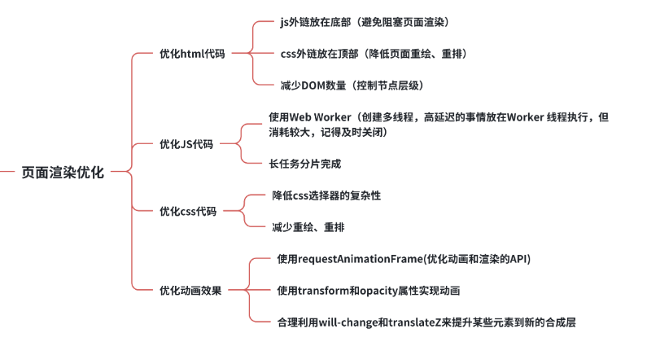
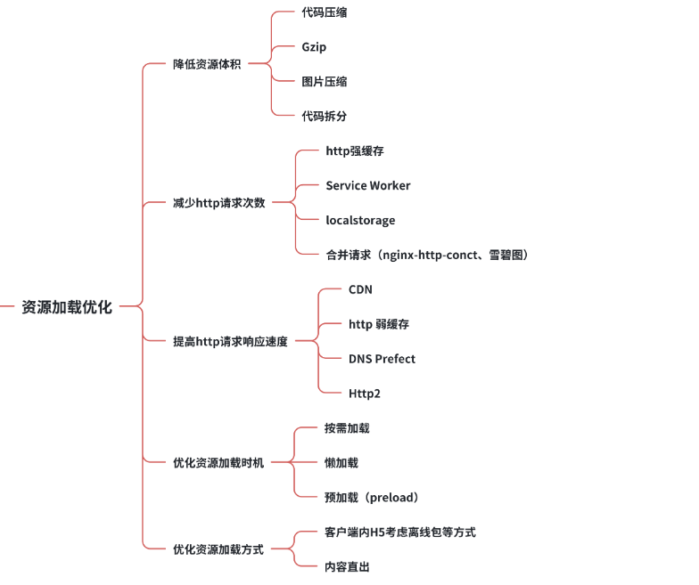

# 防抖 节流（未完）

> https://juejin.cn/post/7353547774174035983?searchId=202406251510170DF063F193B9DC561F85

**防抖（debounce）和节流（throttle）是两种常用的**

**高频触发事件的优化方法。** 也就是限制函数的执行次数

防抖：就是指连续触发事件但是在设定的一段时间内中只执行最后一次。常用于输入框搜索、滚动加载、文本编辑器自动保存等场景。

节流：就是指连续触发事件但是在设定的一段时间内中**只执行一次**。resize时间、scroll时间、快速点击、鼠标滑动、视频播放记录时间、常用于滚动监听、窗口大小改变等场景。

> 实现 https://www.bilibili.com/video/BV1Vy4y1y7tj/?spm_id_from=333.999.top_right_bar_window_history.content.click&vd_source=ceab44fb5c1365a19cb488ab650bab03

- **<font color="Red">防抖实现</font>** 

每触发一次把上一次的定时器清除

- **<font color="Red">节流实现</font>**


# 前端跨域（未完）


# SPA首屏加载慢的优化方案

两大类

- 资源加载优化
- 页面渲染优化





https://blog.csdn.net/weixin_40297452/article/details/136424932

```

减少入口文件的体积：路由懒加载、不同组件拆分成不同的代码模块
静态资源本地缓存:(1)localStorage(2)HTTP缓存 cache-control Etag(3)service worker
UI框架按需加载： Vue.use(ElementUI) 改成 Vue.use(Button)
图像优化:对于不立即可见的图像使用 lazy loading。
代码压缩和优化:Gzip、Brotli或UglifyJS对HTML、CSS和JavaScript文件进行压缩。 删除无关的注释和空格代码
服务器端渲染（SSR）优化   使用框架如Next.js或Gatsby，它们支持SSR

3. 内容优先级

5. 浏览器缓存：
    * 在服务器端设置合适的缓存头，以指示浏览器如何缓存文件。
    
    * 减少DOM更新数量，使用不可变数据结构，并批量更新DOM。
    * 使用React或Angular等库，它们提供了内置优化技术
```

