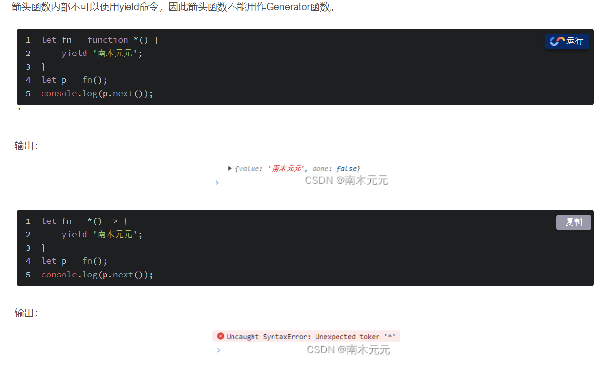

**当多个开发者在不同分支上，修改同一文件并尝试合并，**

Git可能会遇到合并冲突，Git无法自动决定如何合并这些修改，

**箭头函数和普通函数区别**

> 正确：箭头函数函数体内的this是定义时所在的对象而不是使用时所在的对象

[好文 箭头函数& 普通函数](https://blog.csdn.net/weixin_43288600/article/details/135197555)

- 箭头函数没有自己的this，箭头函数不会创建自己的this对象，只会继承在自己作用域的上一层this。

- 箭头函数的this不会改变，call()、apply()、bind()等方法也不能改变箭头函数中this的指向。

- 箭头函数没有prototype属性，undefined

- 箭头函数不能作为构造函数，箭头函数没有自己的this，没有prototype属性，所以也就不能用作构造函数，即不可以对箭头函数使用`new`命令，否则会抛出错误。

```
为什么会这样呢？这其实跟new内部实现有关，new的实现步骤如下：

创建一个新的空对象
设置原型，将对象的原型设置为函数的prototype对象（箭头无法实现）
让函数的this指向这个对象，执行构造函数的代码（箭头无法实现）
返回新的对象
```

- 箭头函数不能使用arguments对象。arguments是一个对应于传递给函数的参数的类数组对象。arguments是在所有普通函数中都可用的一个类数组对象，类数组不是数组，而是类似数组的对象**，**它除了length属性和索引之外，不能调用数组的方法。所以通常会使用Array.prototype.slice.call(arguments)/Array.from(arguments)/[...arguments]的方式，将它转换成一个数组。

  如果要用，可以用rest参数代替

- 箭头函数不能用作Generator函数



箭头函数不适用的场景 ① 对象方法，且方法内部使用this ② 需要动态this（比如按钮点击之后的回调函数）

**localStorage和cookie**

> cookie可以设置HTTPONLY属性，使其不能被JS修改
>
> localStorage的数据在浏览器关闭之后，就自动销毁了【错*localStorage会*保留,而sessionStorage会被删除】
>
> localStorage的存储遵循同源策略【对的`localStorage` 遵循同源策略，这意味着网页只能对自己域名下的 `localStorage` 数据有访问权。如果尝试访问不同源的 `localStorage` 数据，浏览器将会阻止这种尝试并抛出安全错误。】
>
> cookie可以设置过期时间

http 是一种无状态协议，就是一种不保存状态的协议，一个服务器不清楚是不是同一个浏览器在访问它。为了解决 http 无状态的特点，会在请求中插入 token，然后发送请求，告诉服务器，但是这种方式容易出错。

什么技术可以实现每次HTTP请求都自动带数据给服务器？

- cookie

  浏览器发起HTTP请求，服务器会进行cookie设置，set-cookie，有名-值两个信息，服务器会把名和值属性内容填充完整，发给浏览器后浏览器保存。这样浏览器以后发送的每一个请求都会自动附上这个。说白了Cookie就是一种存储在浏览器的数据而已Cookie。

但只要电脑被黑，cookie中的重要信息就会被泄露，引入session。

- session会话 

  既然浏览器和服务器是在进行会话的，浏览器访问服务器就是会话的开始，比较模糊的是会话结束的时间，因为你关掉网页，也有可能只是按错而已。因此不同的网站对与每个用户的会话都设定了时间以及唯一的ID，这里的ID就是通常所说的Session lD，时间是结束会话的时间。因为是服务器定义的数据，一般保存在数据库里

  有了用户名为什么还要Session lD？通常是一串没有规律的字符串。

 

如果服务器依旧使用基于cookie的session，在特定时间有大量用户访问服务器的时候，服务器就会面临可能需要存储大量Session lD在服务器里。但是如果有多台服务器，一台服务器存储了session id，又会面临需要分享session id给其他服务器，因为可能出现存储服务器的超载。如果把session id放在数据库，数据库崩溃也会影响服务器获取sessionid。

各种原因+需求=出现了JWT，Json Web Token

- token 

  用户第一次登陆网页之后，服务器生成一个JWT，服务器不需要保存这个JWT，只需要保存JWT签名的密文，接着发送JWT给浏览器，可以让浏览器以cookie或者storage的形式进行存储，假设以cookie的形式保存下来，这样用户每次发送请求都会把JWT发给服务器，用户就不需要重新输入用户名和密码。和session很类似。但JWT存在用户哪里。

**以下哪个HTTP1.1中用于实现资源的强缓存HTTP头**

> cache-control, etag, last modified, expires

在HTTP/1.1中，Cache-Control头用于控制缓存的行为，它可以用来实现资源的强缓存。

Expires 是 *HTTP*/1.0

**BEM命名**

Bem 是块(block)、元素(element)、修饰符(modifier)的简写

`[block]__[element]--[modifier]`

**JS，Promise对象用于处理异步操作，以下那些描述正确的反映了promise的行为和特性**

# 代码题

## 补充知识

**有哪些方法可以获取URL中的参数？最新的API了解吗？**

——在vue中 通过this.route.query.xxx直接获取。假如url: https://www.rita.com?name=123&age=20 希望输出{name: '123', age:'20'}

①split方法，将字符串以指定的字符分隔为数组

```javascript
function getParams(url) {
	let urlStr = url.split('?')[1]
	let pbj = {}
	let paramsArr = urlStr.split('&')
	for(let i=0, len=paramsArr.length; i<len; i++) {
		let arr = paramsArr[i].split('=')
        obj[arr[0]] = arr[1]
	}
    return obj
}
```

②通过URLSearchParams方法

```javascript
function getParams(url) {
	let urlStr = url.split('?')[1]
	const urlSearchP = new urlSearchParams(urlStr)
    const result = Object.fromEntries(urlSearchP.entries())
    return result 
}
```

在vue中使用`Object.fromEntries`会报错，安装插件`npm i polyfill-object.fromentries`

③ 正则表达式

### URLSearchParams

**URLSearchParams** 是一个 JavaScript 内置类，用于处理 **URL 查询字符串**（query string）的解析和构建。

new URLSearchParams()：参数可有可无，接收`name=123&password=456`类似的参数，如果不传递参数则是组装新的url参数

```javascript
// 浏览器中的URL：http://127.0.0.1:5501/103001_URLSearchParams.html?name=jerry

// 获取url中的查询字符串
const searchStr = window.location.search;
// URLSearchParams() 构造函数可以接受一个查询字符串作为参数，用于初始化 URLSearchParams 对象。
const searchParams = new URLSearchParams(searchStr);
console.log('searchParams', searchParams);
```

- size  返回查询参数的数量

```javascript
const searchParams= new URLSearchParams('key1=value1&key2=value2&key3=value3');
console.log(searchParams.size); // 输出：3
```

- append 查询字符串中添加一个新的参数。 可以append多个同名的，不会覆盖，会**追加**

```javascript
// URLSearchParams.append(name, value)：向查询字符串中添加一个新的参数。可以append多个同名的，不会覆盖，会追加
searchParams.append("gender", "male");
searchParams.append("gender", "female");
```

- get(name)

```javascript
console.log(searchParams.get('gender')); // 字符串 'male' 如果有多个，默认返回第一个
console.log(searchParams.get('age'));    // get 一个不存在的，返回null
```

- getAll 获取指定名称的所有参数值，返回一个数组。

```javascript
console.log(searchParams.getAll('gender')); // 数组  ['male', 'female']
```

- has(name) 检查查询字符串中是否存在指定名称的参数。如果存在，则返回 `true`，否则返回 `false`。 

```javascript
console.log(searchParams.has('gender')); // 存在返回true
console.log(searchParams.has('age'));    // 不存在返回false
```

- set(name,value) 设置指定名称的参数值。如果参数已存在，则会替换为新的值。

```javascript
// URLSearchParams.set(name, value)：设置查询字符串中指定参数的值，如果参数不存在，则添加新的参数。
searchParams.set('age', 18);
console.log(searchParams.get('age')); // 18
```

- delete(name)

```javascript
// URLSearchParams.delete(name)：从查询字符串中删除指定的参数。
searchParams.delete('age');
console.log(searchParams.get('age')); // null  因为age被上一行删除了，所以返回null
```

- toString() 将 URLSearchParams 对象转换为字符串表示形式，返回查询字符串。

```javascript
// URLSearchParams.toString()：将 URLSearchParams 对象转换为字符串表示形式，返回查询字符串。
  console.log(searchParams.toString()); // name=jerry&gender=male&gender=female
```

- sort()  按照参数名称对查询字符串中的参数进行排序。

```javascript
// 按照参数名称对查询字符串中的参数进行排序。
  searchParams.sort();
  console.log(searchParams.toString()); // gender=male&gender=female&name=jerry
```

- entries() 

```javascript
// entries() 方法用于返回一个迭代器，该迭代器包含了所有查询参数的键值对。
  for (const [key, value] of searchParams.entries()) {
    console.log(key, value);
  }
  // gender male
  // gender female
  // name jerry
```

- forEach()  遍历。回调第一个参数是value，**第二个参数是key**

```javascript
searchParams.forEach((value, key)=>{
  console.log(key, value);
})
// gender male
// gender female
// name jerry
```

- keys() 返回一个迭代器，该迭代器包含了所有查询参数的键。

```javascript
// keys() 方法用于返回一个迭代器，该迭代器包含了所有查询参数的键。
for (const key of searchParams.keys()) {
  console.log(key);
}
// gender
// gender
// name
```

- values() 

用于返回一个迭代器，该迭代器包含了所有查询参数的值。

```javascript
// values() 方法用于返回一个迭代器，该迭代器包含了所有查询参数的值。
  for (const value of searchParams.values()) {
    console.log(value);
  }
  // male
  // female
  // jerry
```


