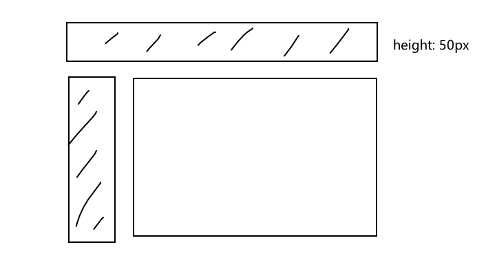

# 小厂电话场景题

用JS实现：一个很大的数字A，我们用字符存储他，注意A超过了64位。此时随便来一个数字B，我们怎么算A除以B？

4×4华容道

# 货拉拉实习面试

介绍项目，讲解一下怎么部署的

三道笔试题

> 实现一个休眠函数 sleep
> 在执行 sleep 函数后,暂停 1s ，输出'hel1o world'

```javascript
function sleep(ms) {
    return new Promise(resolve => setTimeout(resolve, ms));
}

async function execute() {
    await sleep(1000); // Pause for 1 second
    console.log('hel1o\nworld');
}

// Call the execute function
execute();
```

> **INPUT:**
>
> const shoppingCart = [
>     { name: "Apple", price: 0.99, quantity: 10 },
>     { name: "Cherry", price: 3.99, quantity: 6 },
>     { name: "Cherry", price: 2.99, quantity: 5 },
>     { name: "Cherry", price: 4.99, quantity: 7 },
>     { name: "Cherry", price: 5.99, quantity: 8 },
> ];
>
> **OUTPUT:**
>
> {
>     Apple: [{ name: "Apple", price: 0.99, quantity: 10 }],
>     Cherry: [
>         { name: "Cherry", price: 3.99, quantity: 6 },
>         { name: "Cherry", price: 2.99, quantity: 5 },
>         { name: "Cherry", price: 4.99, quantity: 7 },
>         { name: "Cherry", price: 5.99, quantity: 8 }
>     ]
> }

```javascript
/**
 * 合并购物车中的重复项
 * @param {array} items 一个对象列表
 */
function merge_shopping_cart_items(items) {
  // 使用reduce函数合并购物车中的重复项
  return items.reduce((acc, item) => {
    // 检查项目名称是否已经存在于累加器中
    if (!acc[item.name]) {
      // 如果不存在，创建一个新的数组
      acc[item.name] = [];
    }
    // 将当前项目推入相应名称的数组中
    acc[item.name].push(item);
    
    return acc;
  }, {});
}

// 请勿删除，模块导出的函数才能被测试模块调⽤
module.exports = {
  merge_shopping_cart_items
};
```


# 迈瑞医疗实习面试

介绍项目

promise

数组方法+结合项目

防抖节流

深浅拷贝 有用过吗 用在哪里 lodash

事件冒泡

自适应



居中怎么实现？

移动端项目有吗？

说说你了解的自适应

跨域


# 京谷粒笔试

```
Please write a program in any language, to reverse a linked list every two nodes. Need test cases.
e.g. input: 1->2->3->4->5, output: 5->3->4->1->2. Input: 1->2, output: 1->2


Please write a program in any language, to reverse a linked list every N nodes. Need test cases.
e.g. input: 1->2->3->4->5, N = 2, output: 5->3->4->1->2. input: 1->2->3->4->5, N = 1, output: 5->4->3->2->1.
```

