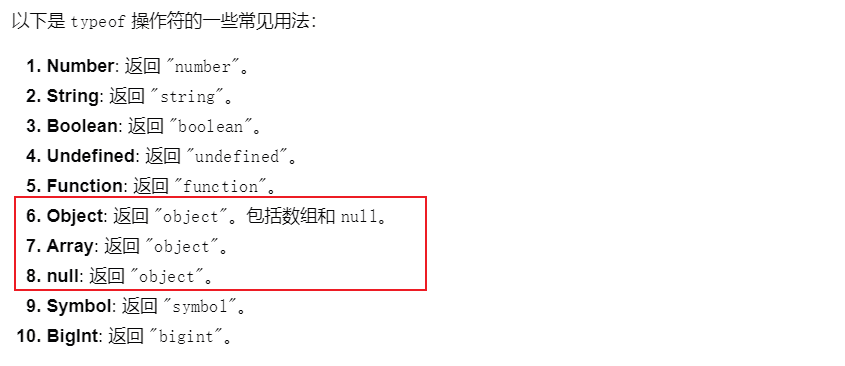

# JS数据类型

基本数据类型 

Null、Undefined、Symbol(ES6) 、Boolean、String、Number、BigInt(ES2020 表示大于`2^53 - 1`的整数。)

引用数据类型

object、array、function

# 深拷贝 & 浅拷贝

> 要用到的 JS 知识点： for in, hasOwnProperty

**深拷贝和浅拷贝是两种不同的对象复制方式**，它们的区别主要在于复制对象时是否**递归复制**对象的属性值。

## 赋值和浅拷贝的区别

把一个对象赋值给一个新的变量时，赋的其实是该对象的在栈中的地址，而不是堆中的数据。也就是两个对象指向的是同一个存储空间，无论哪个对象发生改变，其实都是改变的存储空间的内容，因此，两个对象是联动的。

## 浅拷贝（Shallow Copy）

浅拷贝仅复制对象的一级属性，如果属性值是引用类型，则复制的是引用地址，而不是实际的对象。这意味着，如果原对象的属性值是一个对象，那么拷贝后的对象和原对象共享同一个引用地址。

实现方法：

- 使用 `Object.assign()` 方法。
- 使用展开运算符 `...`。
- 使用 `Array.prototype.slice()` 方法（对于数组）。

```javascript
let original = { a: 1, b: { c: 2 } };
let shallowCopy = Object.assign({}, original);

// 修改浅拷贝对象的嵌套属性
shallowCopy.b.c = 3;

console.log(original.b.c); // 输出 3，原对象也被修改了
```

原对象有 a b c属性，但是其中属性c是引用类型，所以复制对象一级属性的时候，复制的是引用地址

```javascript
let originalArray = [1, 2, 3, 4, 5];
let copiedArray = originalArray.slice(); // 创建一个原数组的浅拷贝

// 修改拷贝数组不会影响原数组
copiedArray[0] = 'changed';
console.log(originalArray); // 输出: [1, 2, 3, 4, 5]
console.log(copiedArray);  // 输出: ['changed', 2, 3, 4, 5]
```


### 代码实现

遍历原对象的所有属性，赋值给新开辟的对象空间

```javascript
let obj1 = {
  name: '李三',
  age: 8,
  friends: ['张三','王五','哈哈']
}
let newobj = shallowCopy(obj1)

function shallowCopy(srcObj) {
  let newObjtmp = {}
  for(let prop in srcObj) {
    console.log(prop); // name age friends
    if(srcObj.hasOwnProperty(prop)) {
      newObjtmp[prop] = srcObj[prop]
    }
  }
  return newObjtmp
}

console.log('newObj = ', newobj);
//浅拷贝只能复制一级属性，且如果一级属性是引用类型，只复制地址

obj1.friends[0] = '更改'
console.log(newobj.friends); // ['更改', '王五', '哈哈']

```


## 深拷贝（Deep Copy）

深拷贝会递归复制对象的所有层级，创建一个新的对象，并且复制原对象的所有属性值。如果属性值是引用类型，则为这个属性值创建一个新的实例。

深拷贝可以通过以下几种方式实现：

- 使用 `JSON.stringify()` 和 `JSON.parse()` 方法（但有局限性，例如不能复制函数、undefined、循环引用等）。
- 使用第三方库，如 Lodash 的 `_.cloneDeep()` 方法。
- 手动实现深拷贝函数。

```javascript
let original = { a: 1, b: { c: 2 } };
let deepCopy;

// 使用 JSON 方法实现深拷贝（有局限性）
deepCopy = JSON.parse(JSON.stringify(original));

// 修改深拷贝对象的嵌套属性
deepCopy.b.c = 3;

console.log(original.b.c); // 输出 2，原对象未被修改
```

### 代码实现

> 递归拷贝

```javascript
var obj = {   // 原数据，包含字符串、对象、函数、数组等不同的类型
  name: "test",
  main: {
    a: 1,
    b: 2
  },
  fn: function(){
    console.log('This is a function');
  },
  friends: [1, 2, 3, [22, 33]]
}

function deepCopy(obj) {
  let newObj = null;
  
  // typeof(obj)=object 有三种情况 null object array
  if(typeof(obj) == 'object' && obj != null) {
    newObj = obj instanceof Array? []:{}
    for(let i in obj) {
      newObj[i] = deepCopy(obj[i]) //递归调用
    }
  } else {
    //函数的情况
    newObj = obj
  }

  return newObj
}

var obj2 = deepCopy(obj)
obj2.name = '修改成功'
obj2.main.a = 100
console.log(obj)
console.log(obj2)
```

- 问题：

  函数没有深拷贝、循环引用问题、特殊对象没有处理（Date）、Symbol BigInt没有处理

> weakmap

- 循环引用可以用Map、WeakMap处理

在深拷贝函数中，可以使用 `WeakMap` 来存储已经拷贝过的对象，避免循环引用导致的无限递归。

```javascript
function deepCopy(target, h = new WeakMap()) {
    // 1. 判断 target 是否为对象类型（包括数组）
    if (typeof target === 'object') {
        // 2. 检查 WeakMap 中是否已经存在该对象，防止循环引用
        if (h.has(target)) return h.get(target); 

        // 3. 如果是数组，创建一个空数组，否则创建一个空对象（不带原型的对象）
        const newTarget = Array.isArray(target) ? [] : Object.create(null);

        // 4. 把当前对象存入 WeakMap，防止后续遇到循环引用
        h.set(target, newTarget);

        // 5. 遍历对象的所有键，递归拷贝每一个属性
        for (const key in target) {
            newTarget[key] = deepCopy(target[key], h);
        }

        // 6. 返回深拷贝的新对象
        return newTarget;
    } else {
        // 7. 如果 target 不是对象（如字符串、数字、布尔值等），直接返回
        return target;
    }
}

```

- 解析语句 `if (h.has(target)) return h.get(target); `

h 是一个 WeakMap，用于记录已经被复制过的对象。

```javascript
let obj = { name: "Alice" };
obj.self = obj; // 形成了循环引用

let copy = deepCopy(obj);

当 deepCopy 遍历到 obj.self 时，由于 self 又指向 obj 自己，函数会再次尝试拷贝 obj，这样就陷入了无限递归。

使用 WeakMap，在第一次拷贝 obj 时，obj 和它的拷贝对象会被存入 WeakMap。

当再次遇到 obj 时，h.has(obj) 会返回 true，直接通过 h.get(obj) 获取已经拷贝的对象，从而避免重复拷贝和无限递归。
```


# Map & WeakMap

**Map**：键可以是任意类型，包括对象、函数、基本类型（例如字符串、数字等）。

**WeakMap**：键**必须是对象**，而且这些对象是**弱引用**的（Weak References）。这意味着，如果一个对象不再有其他引用（除了作为 WeakMap 的键），该对象可以被垃圾回收，WeakMap 不会阻止垃圾回收器回收这些对象。

## 示例 WeakMap 和垃圾回收

```javascript
let wm = new WeakMap();

let user = { name: "Alice" };
wm.set(user, "User data for Alice");

// 现在 WeakMap 里有一对键值对：
// user (对象) -> "User data for Alice"

// 我们仍然可以访问 `user`
console.log(wm.get(user)); // 输出: "User data for Alice"

// 如果我们移除了对 `user` 的引用：
user = null;

// 由于 WeakMap 对 `user` 是弱引用，
// 一旦 `user` 没有其他引用，它将被垃圾回收。
// 因此 `wm` 中的这个键值对会被自动删除。

```

解释：

1. **弱引用**：在代码中，`WeakMap` 对键 `user` 对象的引用是**弱引用**。这意味着如果没有其他地方引用这个对象（比如我们将 `user` 设置为 `null`），垃圾回收器（GC）将会自动清理掉这个对象以及它在 `WeakMap` 中的键值对。
2. **垃圾回收**：在将 `user` 设为 `null` 后，`user` 对象没有其他引用点，因此它会被垃圾回收器标记为可回收。当垃圾回收发生时，`WeakMap` 中与该对象相关的键值对也会被自动移除。
3. **WeakMap 优势**：这样做的好处是，当我们不再需要某个对象时，WeakMap 不会阻止垃圾回收器回收它。这使得 `WeakMap` 非常适合用作缓存或与对象相关的临时数据存储，确保这些临时数据不会阻止相关对象的回收。

## weakmap处理循环引用

循环引用是什么？循环引用（Circular Reference）是指两个或多个对象相互引用，形成一个闭环。这在 JavaScript 等语言中尤其常见，因为对象可以通过引用共享。

```javascript
let obj1 = {};
let obj2 = {};

obj1.ref = obj2;
obj2.ref = obj1;

obj1 和 obj2 通过相互引用形成了一个循环。如果没有其他引用指向 obj1 和 obj2，理论上它们应该被垃圾回收。但有些垃圾回收算法（例如早期的引用计数法）会误以为它们仍然被引用，从而无法回收它们，导致内存泄漏。
```

在进行对象的深拷贝时，如果存在循环引用，可能会导致无限递归，最终导致栈溢出错误。

- 例子：使用 `WeakMap` 解决循环引用

```javascript
let wm = new WeakMap();

let obj1 = { name: "object 1" };
let obj2 = { name: "object 2" };

wm.set(obj1, obj2); // obj1 是键，obj2 是值
wm.set(obj2, obj1); // obj2 作为键，obj1 作为值

// 现在 obj1 和 obj2 形成了一个相互引用的循环
console.log(wm.get(obj1)); // 输出: { name: "object 2" }
console.log(wm.get(obj2)); // 输出: { name: "object 1" }

// 如果我们将 obj1 和 obj2 都设为 null，WeakMap 不会阻止它们被垃圾回收
obj1 = null;
obj2 = null;

// 在没有其他引用时，这两个对象都会被垃圾回收，即使 WeakMap 中仍然有它们的键
```


# typepf  & instanceof

- `typeof` 操作符不会对 `null` 进行特殊处理，它将 `null` 视为对象。
- `typeof` 不能区分数组和普通对象，两者都返回 `"object"`。



- instanceof

在 JavaScript 中，`instanceof` 是一个二元操作符，用于测试构造函数的 `prototype` 属性是否出现在某个实例对象的原型链上。如果出现在原型链上，则表达式返回 `true`，表示该实例是该构造函数的实例；如果不在，则返回 `false`。