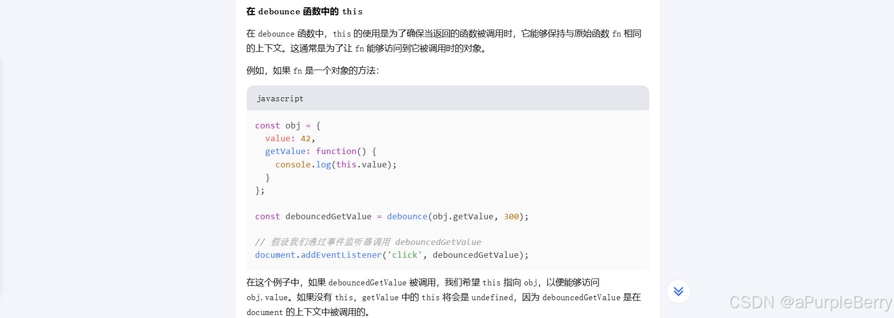

# 防抖（Debounce）

防抖是指短时间内大量触发同一事件，只会在**最后一次**事件完成后延迟执行一次函数。

防抖的典型应用场景是输入框的搜索建议功能，用户输入时不需要每次输入都去查询，而是在用户停止输入一段时间后才进行查询。

```javascript
function debounce(fn, delay) {
        let timer = null
        return function (...args) {
                if (timer) clearTimeout(timer)
                timer = setTimeout(() => {
                        timer = null
                        fn.apply(this, args)
                }, (delay + '') | 0 || 1000 / 60)
        }
}

```
- 为什么每次调用这个函数的时候，timer都是同一个？
涉及到了闭包的概念，使得返回的函数能够持续访问和修改 timer 变量，这是实现防抖功能的关键。
- ...args是什么
称为“rest参数”（rest parameters）
注意：① ...args 会将所有传入的参数收集到一个名为 args 的数组中。② 这个数组包含了所有传递给函数的参数，无论传入多少个参数。
- this
this 是一个关键字，它指向函数执行时的上下文对象。

- 在 JavaScript 中，apply 函数是存在的，它是 Function 对象的一个方法。apply 允许你调用一个函数，并指定函数的 this 值，同时传递一个参数数组给函数。
- delay
>`(delay + '') | 0 || 1000 / 60`
>delay + ''：这部分将 delay 转换为字符串（通过隐式类型转换）。如果 delay 已经是一个数字，这个操作不会改变它的值，但如果 delay 是其他类型（如字符串或 null），它将被转换为字符串。
>| 0：这是一个按位或操作，它将字符串转换为一个整数。在 JavaScript 中，任何与 0 进行按位或操作的字符串都会被转换为该字符串的数值表示（如果可能）。如果字符串不是一个有效的数字，结果将是 0。
>|| 是逻辑或操作符。如果前面的表达式（(delay + '') | 0）的结果是 0 或 null 或 undefined 或任何其他假值，那么逻辑或操作符将评估并返回后面的表达式（1000 / 60）。


# 节流（Throttle）
节流是指在指定的时间间隔内，只允许函数执行一次，不管事件触发了多少次。这可以确保在给定的时间间隔内，函数只执行一次。

```javascript
function throttle(fn, interval) {
        let timer = null
        return function (...args) {
                if (timer) return
                timer = setTimeout(() => {
                        timer = null
                        fn.apply(this, args)
                }, (interval +'')| 0 || 1000 / 60)
        }
}

```

# 防抖&节流中的this
在 JavaScript 中，this 是一个关键字，它指向函数执行时的上下文对象。函数的 this 值是在调用时确定的，而不是在定义时确定的。这意味着同一个函数在不同的调用方式下，this 的值可能不同。

在 JavaScript 中，函数可以作为一个对象的方法被调用，这时 this 会指向那个对象。例如：

```javascript
const obj = {
  myMethod: function() {
    console.log(this);
  }
};

obj.myMethod(); // 输出 obj 对象
```
<font color="red">**在 debounce 函数中，this 的使用是为了确保当返回的函数被调用时，它能够保持与原始函数 fn 相同的上下文。这通常是为了让 fn 能够访问到它被调用时的对象。**</font>

```javascript
const obj = {
  value: 42,
  getValue: function() {
    console.log(this.value);
  }
};

const debouncedGetValue = debounce(obj.getValue, 300);

// 假设我们通过事件监听器调用 debouncedGetValue
document.addEventListener('click', debouncedGetValue);
```