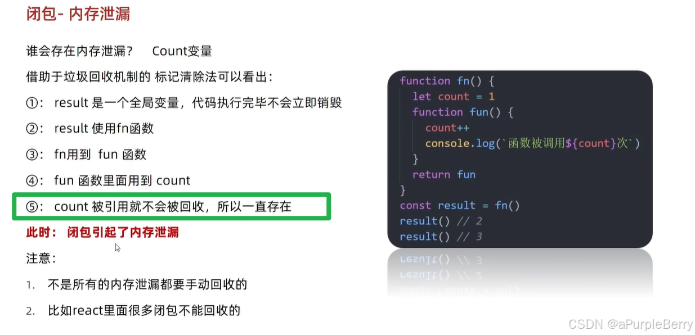

# 闭包 closure
闭包=内层函数+引用的外层函数变量

```javascript
function createCounter() {
  let count = 0;
  return function() {
    count += 1;
    console.log(count);
  };
}

const counter = createCounter();
counter(); // 输出 1
counter(); // 输出 2
```
在这个例子中，createCounter 函数创建了一个局部变量 count 和一个内部函数。内部函数访问并修改了 count 变量。当 createCounter 函数执行完毕后，通常 count 变量应该被垃圾回收。但由于返回的内部函数形成了一个闭包，它仍然保持着对 count 变量的引用，因此 count 变量不会被回收，直到闭包被销毁。
## 应用
- 闭包的形式-统计函数调用的次数

不是闭包的写法：（i属于全局变量，如果在全局修改之后会有问题）
```javascript
let i=0
function fn() {
  i++
  console.log(`函数被调用了${i}次`)
}
```
闭包写法，实现数据私有
```javascript
function count() {
	let i=0
	function fn() {
	  i++
	  console.log(`函数被调用了${i}次`)
	}
	return fn
}

const res = count()
res() // 1
res() // 2
```

## 问题-内存泄漏
