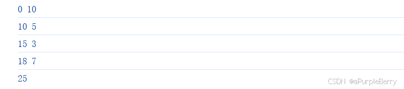

# reduce
> 数组变量名.reduce((sum,value) => {
> // 向sum变量上累加值
> // 一定要return值 给下一次循环sum初始值
> },0)
```javascript
let arr = [10, 5, 3, 7]

let res = arr.reduce((sum, value) =>{
  console.log(sum,value);
  
  sum += value
  return sum
},0)

console.log(res);
```

### 应用：数据扁平化
# filter
filter 方法用于过滤数组，返回数组中满足条件的元素所组成的**新数组**。

```javascript
let newArray = array.filter(function(element, index, array) {
    // 返回 true 或 false
}, thisArg);

element：当前正在处理的数组元素。
index（可选）：当前正在处理的元素的索引。
array（可选）：调用 filter 方法的数组。
thisArg（可选）：执行回调时使用的 this 值。
newArray：包含通过测试的所有元素的新数组。
```
应用场景：当你需要根据特定条件筛选数组元素时

```javascript
假设我们有一个数字数组，我们想要找出所有大于 10 的数字：

const numbers = [1, 12, 5, 8, 20, 7, 30];
const filteredNumbers = numbers.filter(function(number) {
    return number > 10;
});

console.log(filteredNumbers); // 输出: [12, 20, 30]
```

# find
返回数组中满足提供的测试函数的**第一个<font color="red">元素的值</font>**。如果没有元素满足测试函数，find 方法返回 undefined。

```javascript
let result = array.find(function(element, index, array) {
    // 返回 true 或 false
}, thisArg);

element：当前正在处理的数组元素。
index（可选）：当前正在处理的元素的索引。
array（可选）：调用 find 方法的数组。
thisArg（可选）：执行回调时使用的 this 值。
result：数组中满足测试函数的第一个元素的值，否则返回 undefined。
返回值
```

- 例子

```javascript
const users = [
    { id: 1, name: 'Alice' },
    { id: 2, name: 'Bob' },
    { id: 3, name: 'Charlie' }
];

const foundUser = users.find(user => user.id === 2);

console.log(foundUser); // 输出: { id: 2, name: 'Bob' }
```

## 从数组 [1,2,3,4,5,6] 中找出值为 2 的元素
- 用find

```javascript
// 从数组 [1,2,3,4,5,6] 中找出值为 2 的元素
console.log('从数组 [1,2,3,4,5,6] 中找出值为 2 的元素');

let arr1 = [1,2,3,4,5,6]
let res1 = arr1.find((ele,index)=>{
  return ele === 2
})
console.log(res1);
```

- 用filter

```javascript
let res2 = [1,2,3,4,5,6].filter((ele) => ele === 2)
console.log(res2);
```


这两个方法略有不同，filter返回的是一个数组，数组中包含符合条件的元素。find返回的是第一个满足条件的元素

# forEach
### 用于遍历，forEach 方法没有返回值，它总是返回 undefined。
```javascript
array.forEach(function(element, index, array) {
    // 执行代码
}, thisArg);

element：当前正在处理的数组元素。
index（可选）：当前正在处理的元素的索引。
array（可选）：调用 forEach 方法的数组。
thisArg（可选）：执行回调时使用的 this 值。
undefined：forEach 方法没有返回值，它总是返回 undefined。
```
- 遍历数组

```javascript
const numbers = [1, 2, 3, 4, 5];

numbers.forEach(number => console.log(number));
```