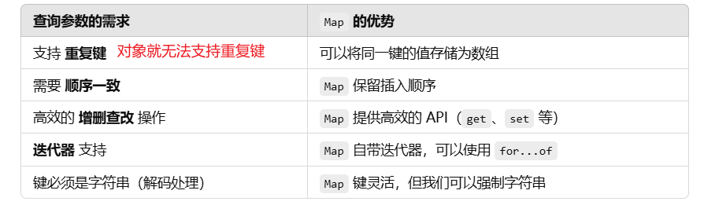

# URL

**URL** 全称是 **Uniform Resource Locator**，即 **统一资源定位符**。简单来说，它是网络上资源（网页、图片、文件等）的“地址”

## 基本结构

一个完整的 URL 由多个部分组成：

协议+主机+端口+路径+查询参数+片段标识符

`https://example.com:8080/path/to/resource?key1=value1&key2=value2#section1`


**协议 (Scheme)**：

- `https://` 是协议部分，表示使用 HTTPS（安全的 HTTP 协议）来访问资源。
- 其他常见的协议包括 `http://`、`ftp://` 等。

**主机名 (Host)**：

- `example.com` 是主机名或域名，表示服务器的地址。

**端口号 (Port)**：

- ```
  :8080
  ```

   是端口号，表示服务器监听的端口。

  - 常见的端口号：HTTP 默认是 **80**，HTTPS 默认是 **443**。

**路径 (Path)**：

- `/path/to/resource` 是路径部分，表示服务器上的资源位置。

**查询参数 (Query String)**：

- `?key1=value1&key2=value2` 是查询参数部分（重点）。
- <font color="red">它是以 `?` 开头的键值对，用来传递额外信息给服务器。</font>

**片段标识符 (Fragment)**：

- `#section1` 是片段标识符，用于指向页面内的某个部分。

## URL 查询参数

**查询参数** 是 URL 中用于向服务器传递额外信息的部分，通常用于 **GET 请求** 或者页面导航时传递数据

查询参数总是位于 URL 中的 **问号 `?` 后面**，多个参数之间用 **`&`** 分隔。

`?key1=value1&key2=value2`

# URLSearchParams

类 **`URLSearchParams`** 是 JavaScript 中的一个 **内置类**，主要用于操作 URL 的 **查询参数**。它提供了方便的 API 来解析、获取、修改、追加和删除 URL 查询字符串中的参数。

## 初始化

- 初始化的三种传入方式

```javascript
// 传入查询字符串
const params = new URLSearchParams("?key1=value1&key2=value2");
console.log(params.toString()); // 输出：key1=value1&key2=value2

// 传入对象
const params2 = new URLSearchParams({ key1: "value1", key2: "value2" });
console.log(params2.toString()); // 输出：key1=value1&key2=value2

// 传入数组
const params3 = new URLSearchParams([
  ["key1", "value1"],
  ["key2", "value2"],
]);
console.log(params3.toString()); // 输出：key1=value1&key2=value2
```

注意这里的输出是 **没有问号的**

## append

向查询参数中添加一个新的 **键值对**。
**不会覆盖已有的同名键**。

```javascript
const params = new URLSearchParams();
params.append("key", "value1");
params.append("key", "value2");

console.log(params.toString()); // 输出：key=value1&key=value2
```

## set

设置指定键的值，如果键已存在，则 **覆盖** 旧值。

```javascript
const test2 = new URLSearchParams();
test2.set("key", "value")
test2.set("key", "value22")
console.log(test2.toString());
```

## get 

获取指定 **键** 的第一个值。如果键不存在，返回 `null`。

```javascript
const test_get = new URLSearchParams("?key=value1&key=value2");
console.log(test_get.get("key")); // 输出：value1
console.log(test_get.get("nonexistent")); // 输出：null
console.log(test_get.getAll("key")); // 输出：['value1', 'value2']
```

## getAll

获取指定键的所有值

```javascript
const test_get = new URLSearchParams("?key=value1&key=value2");
console.log(test_get.getAll("key")); // 输出：['value1', 'value2']
```

## toString


## 迭代器方法

支持 `for...of` 遍历

**`for...of`** 用于遍历 **可迭代对象**（如数组、字符串、`Map`、`Set` 等）。它会直接 **迭代** 对象的 **值**。

# 自己实现URLSearchParams

前置知识，JS数据类型，类型判断，Map，for in for of

- 选择Map



注意 `typeof 得到 object`有：数组 函数 对象 null

URLSearchParams能传入的 有 对象，字符串，数组（这里的数组 对象是无法分清的）

