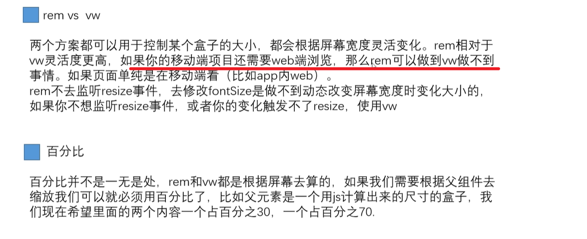
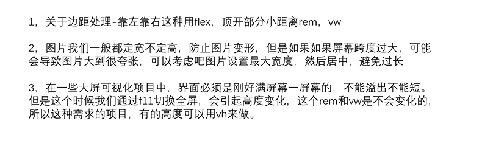

> https://www.bilibili.com/video/BV1PC411372R/?spm_id_from=333.999.0.0&vd_source=ceab44fb5c1365a19cb488ab650bab03

# 屏幕尺寸自适应

## 切换不同css

- 如果是根据不同的屏幕要有不同的布局，一般通过检测屏幕尺寸换不同的站点或者媒体查询使用CSS

E.G. 百度为例，电脑&手机页面不是一个布局

```javascript
根据不同的条件加载不同的CSS文件，以实现响应式设计

它将在屏幕宽度在1px到500px之间的设备上应用：
<link rel="stylesheet" media="screen and (min-width: 1px) and (max-width: 500px)" href="/css/d1.css">

它将在屏幕宽度大于或等于500px的设备上应用：
<link rel="stylesheet" media="screen and (min-width: 500px)" href="/css/d2.css">
```

## flex

- 基本原则，布局更多用flex，尺寸使用rem,vw,vh

### rem

以html字体大小为1rem的大小，html为16px，1rem则16px。rem之所以能自适应就是
根据屏幕大小去用is重新设置html的字体大小。

算法为：html字体大小=(js获取到的当前设备宽度/设计图宽度)*设计图宽度下1rem大小
对应的自动转化库-postcss-pxtorem+js计算

```javascript
let width = Math.min(document.body.clientWidth, 750)
let fontsize = (width/750)*100
document.documentElement.style.fontSize = fontsize + 'px'
```


- 解释

1. 首先，代码使用 `Math.min()` 函数来获取 `document.body.clientWidth` 和 750 之间的最小值。`document.body.clientWidth` 是当前浏览器窗口的宽度，而 750 是一个固定的参考宽度。这意味着无论浏览器窗口的实际宽度是多少，`width` 变量都将被设置为 750 或更小的值。

   **区别 `window.screen.availWidth`和`document.body.clientWidth`**前者通常用于检测设备的屏幕大小，后者通常用于检测浏览器窗口的大小。

2. 然后，代码计算 `fontsize`，方法是将 `width` 除以 750，然后将结果乘以 100。这个计算基于一个假设，即当浏览器窗口宽度为 750 像素时，基础字体大小应该是 100 像素单位（可能是百分比、em 或 px）。

3. 最后，代码将计算出的 `fontsize` 应用到整个文档的根元素（`html` 元素）上，从而改变整个页面的字体大小。这是通过设置 `document.documentElement.style.fontSize` 属性为 `fontsize` 值加上单位 `px` 来实现的。


- 一般也加一个监听事件 `document.body.onresize = function(){/*在这里修改尺寸*/}`

### vh vm

1vw-1%视口宽度，1vh-1%视口高度

假设屏幕宽高为750*1200 那么 1vw就是7.5px 1vh就是12

**使用vw做单位无需做计算，因为vw会自动根据屏幕宽度变化**


vh一般用来做**全屏**设计（比如height:100vh），一般不用做高度宽度的编写。


对应的自动转化库：`postcss-px-to-viewport`

### 百分比

百分比是相对于父元素的百分比，所以一般除非是最外层的容器，否则不具备响应式
调整的功能

### 对比



## 注意事项

