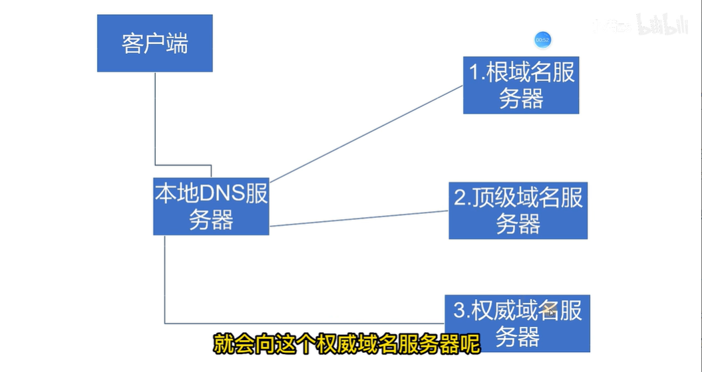
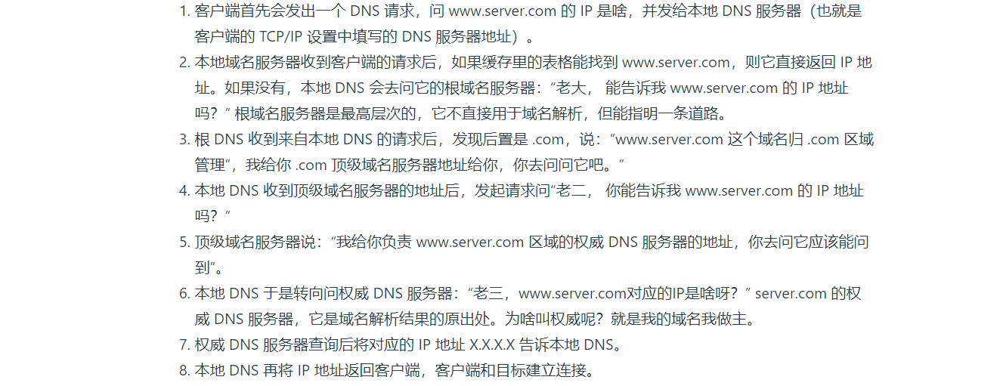
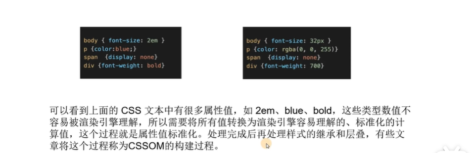
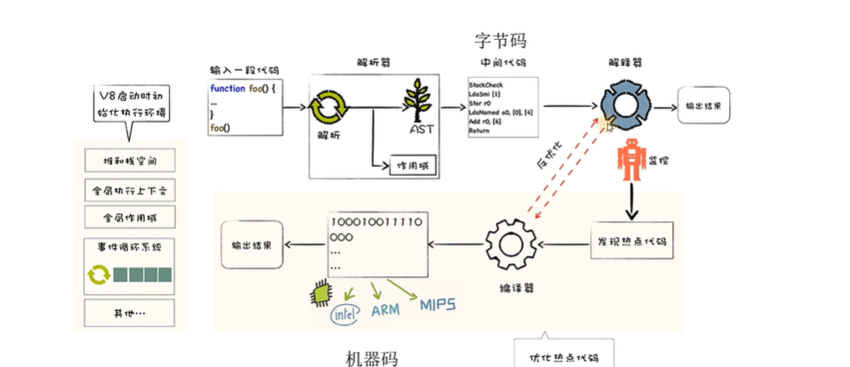
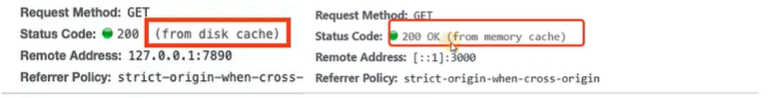
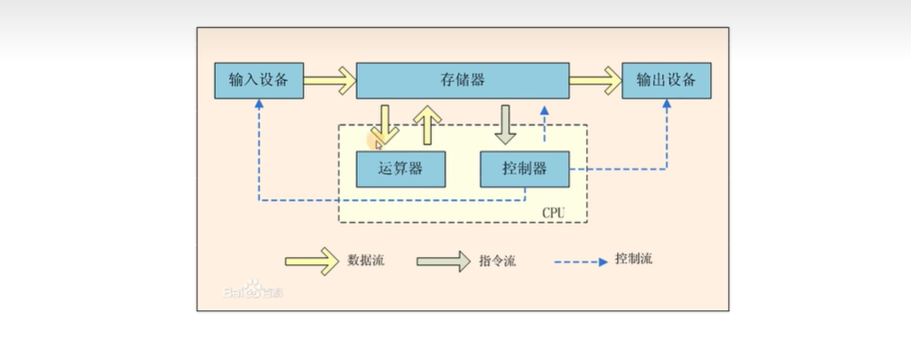
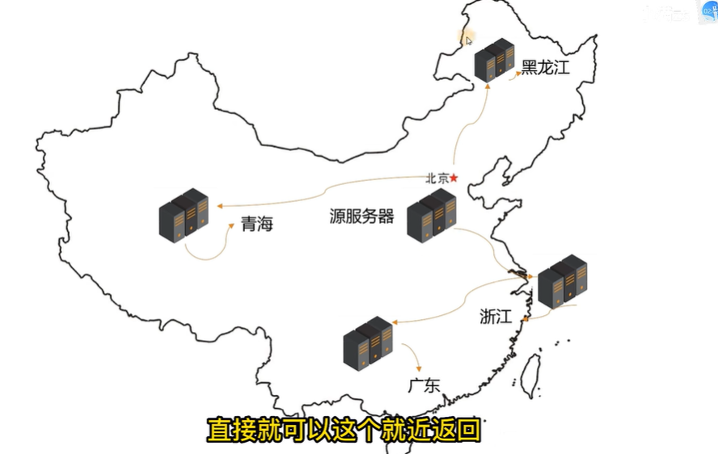

# HTTP

## HTTP请求报文

HTTP请求报⽂ 主要由**请求行、请求头、空行、请求体**构成

- 请求行由 请求方法、URL、HTTP版本号构成

- 请求头由key：value组成, 它可以包含很多不同的字段，⽤于告知服务器有关请求的详细信息。（字段相关：服务器、客户端、请求体、身份验证）

```

Host：标识当前要访问的服务器的地址(和端口)。
User-Agent：标识用户的客户端操作系统型号和版本, 以及使用的浏览器的版本
Accept：指定客户端可接受的内容类型
Content-Length：标识 Body 的长度(单位是字节)
Content-Type：标识 Body 中的数据格式(和字符集)
Authorization：包含客户端提供的身份验证信息。
Referer：标识当前页面从哪跳转过来的

【请求头的作用包括】
缓存控制：通过Cache-Control等字段，客户端和服务器可以控制资源的缓存行为。
身份验证：通过Authorization字段包含客户端提供的身份验证信息。
客户端信息：User-Agent字段用于指示客户端的信息，如浏览器类型、操作系统等。
连接控制：Connection字段可以指示客户端期望的连接类型，如keep-alive表示保持连接。
请求附加数据：Referer字段用于指示当前请求页面的来源页面地址。
Cookie传递：Cookie字段用于发送客户端的cookie信息。
```

- 请求体

  请求体是可选的，通常在发送POST、PUT等请求时 包含请求的实际数据

## HTTP响应报文

状态行、响应头、空行、响应主体

- 状态行：

  HTTP协议版本（通常是"HTTP/1.1"）

  状态码（表示服务器处理结果的三位数字代码）

  状态消息（对状态码的简要描述）

- 响应头部

  由键值对组成，告知客户端有关响应的详细信息。⼀些常⻅的响应头部字段

  ```
  服务器、响应体、cookie
  Content-Type：标识 Body 中的数据格式(和字符集)
  Content-Length：标识 Body 的长度(单位是字节)。
  Server：指定服务器的信息。
  Location：在重定向时指定新的资源位置。
  Set-Cookie：在响应中设置Cookie。
  ```

- 响应主体

  包含服务器返回给客户端的实际数据。

## HTTP请求方法

TOP(I)C

1. GET：申请获取资源，不对服务器产⽣影响
2. HEAD：类似GET，只要求服务器返回头部信息，不返回实际的资源内容。
3. POST：POST请求通常⽤于发送数据，例如提交表单数据、上传⽂件等，会影响服务器，**服务器可能动态创建新的资源或更新原有资源**。
4. PUT：⽤于更新服务器上的资源或创建新资源。
5. DELETE：请求服务器删除指定的资源。
6. TRACE：⽤于测试。要求⽬标服务器返回原始的HTTP请求内容
7. PATCH： ⽤于对资源进⾏部分更新。
8. CONNECT：⽤于代理服务器
9. OPTIONS：⽤于获取服务器⽀持的HTTP⽅法列表，以及针对指定资源⽀持的⽅法

## GET和POST区别

安全、缓存机制、编码、请求报文

GET和POST都是HTTP请求⽅法

GET：申请获取资源，不对服务器产⽣影响

POST通常⽤于发送数据，例如提交表单数据、上传⽂件等，会影响服务器，**服务器可能动态创建新的资源或更新原有资源**。

```
区别

1参数传递
    GET请求的参数⼀般写在URL中，所以GET传送的数据量较⼩，URL长度不能⼤于2KB，且只接受ASCII字符
    POST请求参数⼀般放在请求体中，所以其请求信息没有长度限制， 对于数据类型也没有限制

2请求报文

3安全和幂等
    安全：HTTP协议中，安全是指请求⽅法不会破坏服务器上的资源
    幂等：多次执⾏相同的操作，结果都相同
    GET为安全幂等的，因为它为只读操作
    POST 因为是「新增或提交数据」的操作，会修改服务器上的资源，所以是不安全的
    
4缓存机制
    GET 请求会被浏览器主动cache，如果下⼀次传输的数据相同，那么就返回缓存中的内容，以求更快的展示数据，⽽ POST 不会，除⾮手动设置。
    GET 请求参数会被完整保留在浏览器历史记录⾥，⽽ POST 中的参数不会被保留。
    GET 产⽣的 URL 地址可以被 保存为书签，⽽ POST 不可以。
    GET 在浏览器回退时是⽆害的，⽽ POST 会再次提交请求。
    
5编码方式
    GET 请求只能进⾏ URL 编码 application/x-www-form-urlencoded
    POST ⽀持多种编码⽅式 application/x-www-form-urlencoded 或 multipart/form-data 。为⼆进制数据使⽤多种编码。）
```


# 浏览器输入URL

- URL组成：协议+域名+资源

- DNS查询：服务器有IP，但很难记，如果有一个域名就很好记。DNS就是把IP和域名做了映射，通过域名找到服务器的IP，再去拿到一个正确的资源

- DNS遵循四个查找规则：

①浏览器自身DNS 比如chrome浏览器的地址chrome://net-internals/#dns

②操作系统DNS：一般是在usr下的 etc 一个DNS目录

③本地hosts文件：查看映射关系（switch hosts）

④向域名服务器发送请求。如果以上三个都没有，就会发生④他是使用递归查找的。

客户端把请求发给本地 DNS 服务器，如果缓存里的表格找不到，本地DNS 会去问它的根域名服务器，根域名服务器是最高层次的，它不直接用于域名解析，但能指明一条道路。

 

 

通过DNS查找完之后会得到对应的IP，有了IP之后发送网络请求了。

发起三次握手，就可以发送HTTP请求了，因为到应用层了。

HTTP请求方式，走完浏览器缓存之后，四次挥手断开连接。

- 拿到HTML页面进行渲染

HTML解析器将超文本和标签解析为DOM树。绘制成一个抽象语法树。

CSS是渲染引擎将CSS样式表转化为浏览器可以理解的styleSheets，计算出DOM节点的样式。CSS样式来源主要有3种，分别是通过link 引用的外部CSS文件、style标签内的CSS、元素的 style属性内嵌的CSS。,其样式计算过程主要为:



读到了HTML CSS，在浏览器绘制的时候还会碰到什么？回流与重绘。

- 然后是解析JS

V8引擎解析。输入一段代码（function）->通过解析器变成AST抽象语法树->中间代码->解释器把中间代码 变成机器码。为什么不直接变成机器码？因为网页可以做到跨平台，但每个电脑的硬件不同，所以会转换为字节码（中间代码），适配各个操作系统一些兼容性。V8里的解释器一般用的是 JIT（Jus tin Time） AOT(一般直接编译成二进制，苹果中用的比价多)。



机器码运行在CPU中，计算机组成原理

## 请求方式

get post put delete patch options遇见请求

项目中：如果你是一个post请求，在做项目的时候有两个HTTP请求，第一个是options，第二个才是post请求。这个options请求是哪里来的呢。

第一种情况：跨域的时候，浏览器会发送这个请求，做一个预检，看我们请求能不能成功。第二种情况：自定义请求头的时候，也会触发。

需要注意的是，简单请求(GET、HEAD或POST方法，且Content-Type为application/x-www-form-urlencoded、multipart/form-data或text/plain）不会触发预检请求，浏览器会直接发送实际请求。只有post他的请求都是application JSON的模式才会触发。

## 浏览器缓存

强缓存、协商缓存。

> 小满zs视频
>
> https://juejin.cn/post/7259298281578889273

### 强缓存

- 强缓存：指的是让浏览器强制缓存服务端提供的资源

常用于静态资源 CSS JS

这个缓存是通过后台配置的。一共两个字段。

① Cache-Control

```
后台（服务器）通过往这个请求头中存放 Cache-Control
res.setHeader('Cache-Control', 'max-age=10');
```

② Expires

```
后台（服务器）通过往这个请求头中存放 Expires
res.setHeader('Expires', 'Wed, 21 Oct 2025 07:28:00 GMT');
```

通过这两个字段发送请求后，第二次发送请求时，浏览器直接返回。


- 强缓存的资源存在哪里？

​	① disk cache 硬盘缓存 

​	② memory cache 内存缓存（浏览器多次刷新时）

200后面会加上标记



### 协商缓存

在强缓存里，是否使用缓存是由浏览器来确定的，而协商缓存则是由服务器来告诉浏览器是否使用缓存资源，也就是浏览器每一次都要发送请求到服务器询问是否使用缓存。

## 回流与重绘

回流：当Render Tree中部分或全部元素的尺寸、结构、或某些属性发生改变时，浏览器重新渲染部分或全部文档的过程称为回流。

回流：大流（跟大小有关的是回流）

**会导致回流的操作：**
页面首次渲染
浏览器窗口大小发生改
元素尺寸或位置发生改变
元素内容变化(文字数量或图片大小等等)
元素字体大小变化
添加或者删除可见的 DOM元素
激活CSS伪类（例如::hover )
查询某些属性或调用某些方法


重绘：

当页面中元素样式的改变并不影响它在文档流中的位置时（例如:color , background-color ,visibility 等)，浏览器会将新样式赋予给元素并重新绘制它，这个过程称为重绘。

## 冯诺依曼



# CDN

Content Delivery Network，即内容分发网络。

CDN是构建在`现有网络基础之上的智能虚拟网络`，依靠部署在各地的`边缘服务器`，通过中心平台的负载均衡、内容分发、调度等功能模块，`使用户就近获取所需内容`，降低网络拥塞，`提高用户访问响应速度和命中率`。

网站上线必须要有一台服务器，这个服务器上面存放前端（(html,css,js）资源，然后在搞一个域名，我们之前讲过通过DNS将域名解析我们的服务器的IP(127.XX.XX.XX)。

服务器一定是有一个物理地址的，



- CDN 工作过程

之前讲过浏览器输入url发生了什么那一集，在第一回合需要进行DNS解析，**如果配置了CDN**，DNS会将最终的域名解析权交给CNAME(别名指向）指向的CDN专用DNS服务器。

如果配置了CDN，第三层就会变成智能DNS，会帮你找就近的一个节点，就不是再去权威域名服务器。

-  CDN负载均衡

在CDN中，负载均衡又分为服务器负载均衡和服务器整体负载均衡(也有的称为服务器全局负载均衡)。服务器负载均衡是指能够在性能不同的服务器之间进行任务分配，既能保证性能差的服务器不成为系统的瓶颈，又能保证性能高的服务器的资源得到充分利用。而服务器整体负载均衡允许Web网络托管商、门户站点和企业根据地理位置分配内容和服务。通过使用多站点内容和服务来提高容错性和可用性，防止因本地网或区域网络中断、断电或自然灾害而导致的故障。在CDN的方案中服务器整体负载均衡将发挥重要作用，其性能高低将直接影响整个CDN的性能。

# 浏览器跨域

Same-Origin Policy

出于浏览器的同源策略限制，浏览器会拒绝跨域请求。

同源策略，只能与相同域名、相同协议和相同端口的资源进行通信。

协议，域名，端口，有一个不同就属于跨域。

同源策略是浏览器的行为，是为了保护本地数据不被[JavaScript](https://baike.baidu.com/item/JavaScript/321142?fromModule=lemma_inlink)代码获取回来的[数据污染](https://baike.baidu.com/item/数据污染/53306125?fromModule=lemma_inlink)，因此拦截的是客户端发出的请求回来的数据接收，即[请求发送](https://baike.baidu.com/item/请求发送/55970969?fromModule=lemma_inlink)了，服务器响应了，但是无法被浏览器接收。

## 1 jsonp

**JSONP 全称“JSON with Padding”，译为“带回调的 JSON”，它是 JSON 的一种使用模式。通过 JSONP 可以绕过浏览器的同源策略，进行跨域请求。**

原理：script标签的src属性不受同源策略的限制，可以跨域请求数据

但是只能发送get请求

后端返回的是一个函数，但是这个函数是在前端定义的，他会把值注入到这个函数的参数里面

### 应用

- 服务端 JSONP 格式数据

```javascript
var http = require("http")
var url = require("url")
 
http.createServer((req, res) => {
    var urlobj = url.parse(req.url, true)
    console.log(urlobj.query.callback);
    switch (urlobj.pathname) {
        case "/api/aaa":
            res.end(`${urlobj.query.callback} (${JSON.stringify({
                name: '张三',
                age: 21
            })})`)
            break;
        default:
            res.end("404")
    }
}).listen(3000, () => {
    console.log("start");
})
```

- 客户端实现 callback 函数

```html
<!DOCTYPE html>
<html lang="en">
 
<head>
    <meta charset="UTF-8">
    <meta name="viewport" content="width=device-width, initial-scale=1.0">
    <title>Document</title>
</head>
 
<body>
    <!-- jsonp接口调用 -->
    <script>
        var oscript = document.createElement("script")
        oscript.src = "http://localhost:3000/api/aaa?callback=kerwin"
        document.body.appendChild(oscript)
 
        function kerwin(obj) {
            console.log(obj);
        }
    </script>
</body>
 
</html>
```


## 2 前端解决-代理

## 3 后端解决-设置请求头

## 4 运维端-nginx代理


# ajax

[我的学习笔记](https://blog.csdn.net/yavlgloss/article/details/136722674?ops_request_misc=%257B%2522request%255Fid%2522%253A%2522171982688616800188556669%2522%252C%2522scm%2522%253A%252220140713.130102334.pc%255Fblog.%2522%257D&request_id=171982688616800188556669&biz_id=0&utm_medium=distribute.pc_search_result.none-task-blog-2~blog~first_rank_ecpm_v1~rank_v31_ecpm-1-136722674-null-null.nonecase&utm_term=ajax&spm=1018.2226.3001.4450)

[小满zs博客](https://juejin.cn/post/7238072027637186617?searchId=202407011740548E5D1A98F59EBC35B397)