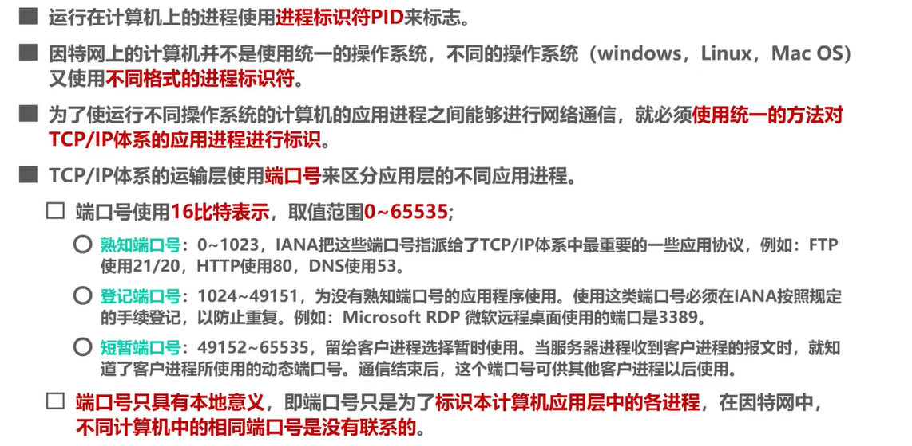
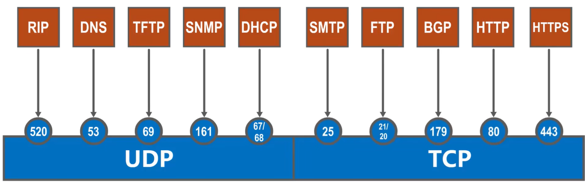
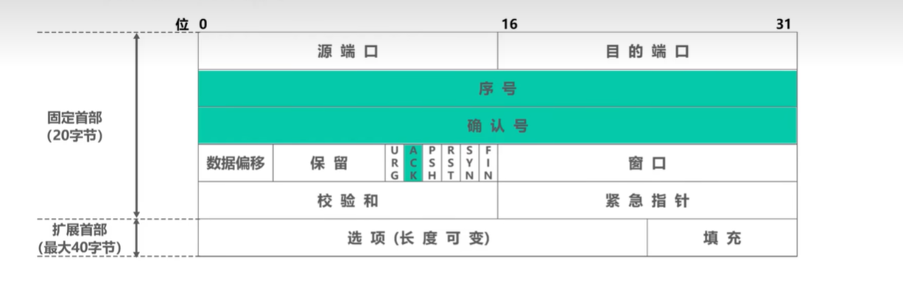

# 传输层

## 概述

**运输层直接为应用进程的逻辑通信提供服务。（“ 逻辑通信 ” 的意思为运输层间的通信好像是沿水平方向传送数据,但事实上并没有一条水平上的物理连接。）**

之前课程所介绍的计算机网络体系结构中的物理层、数据链路层以及网络层它们共同解决了将主机通过异构网络互联起来所面临的问题，实现了主机到主机的通信。

但实际上在计算机网络中进行通信的**真正实体是位于通信两端主机中的进程**。

传输层协议又称为端到端协议，应用进程到应用进程


运输层向高层用户屏蔽了下面网络核心的细节(如网络拓扑、所采用的路由选择协议等)，它使应用进程看见的就好像是在两个运输层实体之间有一条端到端的逻辑通信信道。

根据应用需求的不同，因特网的运输层为应用层提供了两种不同的运输协议，即面向连接的TCP和无连接的UDP，这两种协议就是本章要讨论的主要内容。

【端口号】





【套接字】在TCP/IP网络中，**应用层和传输层的接口**，也是应用程序和**网络**之间的API

【复用】发送方的复用。

发送方某些应用进程发送的应用报文，在运输层使用UDP协议封装成**用户数据报**，称为UDP复用。

另外一些应用进程发送的应用报文，在运输层使用TCP协议进行封装成**TCP报文段**，称为TCP复用。

不管是经过上面哪种复用，封装好的报文经过IP协议封装成IP数据报，即IP复用。

【分用】接收方的分用

**运输层从IP层收到发送给各个应用进程的数据后，必须分别交付给指明的应用进程。**

## TCP & UDP对比

TCP  transmission control protocol 传输控制协议

UDP user datagram protocol 用户数据报协议

面向连接 （一对一）、可靠、字节流、流量控制和拥塞控制、报文首部

```
1、连接 
TCP是⾯向连接的，在传输前需要三次握⼿建⽴连接，释放连接前需要四次握手
UDP不需要连接，直接发送数据包，没有连接建⽴和关闭的过程。

2、服务形式 
TCP是⼀对⼀的通信。在TCP连接中，⼀台客户端与⼀台服务器之间建⽴⼀条连接，进⾏双向通信。
UDP可以是⼀对⼀、⼀对多或多对多的通信。UDP是⽆连接的，⼀个UDP包可以被⼴播到多个⽬标主机，或
者从多个源主机接收UDP包。这使得UDP适⽤于多播和⼴播应⽤。

3、可靠性 
TCP保证数据可靠交付，拥有确认应答和重传机制，⽆重复、不丢失、按序到达; 
UDP尽可能交付，发送数据后不会关⼼数据包是否成功到达接收⽅，不会进⾏重传，不保证可靠性。

4、流量控制和拥塞控制
TCP拥有流量控制、拥塞控制，确保数据发送的速率不会超过接收⽅的处理能⼒，并防⽌⽹络拥塞。
UDP不进⾏流量控制和拥塞控制，数据发送的速率不受限制。

5、⾸部开销
TCP的⾸部⼤⼩通常为20字节，但在选项字段被使⽤的情况下，可能会更⼤。TCP⾸部包含源端⼝号、⽬标端⼝号、序列号、确认号、窗⼝⼤⼩、校验和等字段。最大为60字节
UDP的⾸部⼤⼩固定为8字节。UDP⾸部包含源端⼝号、⽬标端⼝号、包⻓度和校验和字段（各16位）。

6、传输⽅式 
TCP基于字节流，没有边界，但是保证传输顺序和可靠性;
UDP继承了IP层特性，基于数据包，有边界可能出现乱序和丢包。 

7、分⽚⽅式
TCP数据⼤于MSS时会在TCP层将数据进⾏分⽚传输，到达⽬的地后同样在传输层进⾏合并，如果有某个⽚丢失则只需要重传丢失的分⽚即可;
UDP数据⼤于MTU时会在IP层分⽚，则会在IP层合并，如果某个IP分⽚丢失，⽬标主机收到后，在 IP 层组装完数据，接着再传给传输层。
```


## TCP

### 报文

- 一个TCP报文段由首部和数据两部分构成。TCP的全部功能都体现在它首部中各字段的作用。
- TCP将应用进程交付下来的应用报文看做是字节流，存入TCP发送缓存中。

- 但TCP在发送数据时，是从发送缓存取出一部分或全部字节并给其添加一个首部使之成为TCP报文段后进行发送。

  

- 首部格式

  由20字节的固定首部 + 最大40字节扩展首部

  

  - ① 源端口:占16比特，写入源端口号，用来标识发送该TCP报文段的应用进程。

  - ② 目的端口:占16比特，写入目的端口号，用来标识接收该TCP报文段的应用进程。

  - ③ 序号: 指出本TCP报文段所发送的数据的第一个字节的序号。占32比特，序号增加到最后一个后，下一个序号就又回到0。

  - ④ 确认号: 占32比特，期望收到对方下一个TCP报文段的数据的第一个字节的序号，同时也是对之前收到的所有数据的确认。取值范围[0,2”1]，确认号增加到最后一个后，下一个确认号就又回到0。若确认号=n，则表明到序号n-1为止的所有数据都已正确接收，期望接收序号为n的数据。

  - 六个标志位

    - 确认标志位ACK: 取值为1时确认号字段才有效;取值为0时确认号字段无效。TCP规定，在连接建立后所有传送的TCP报文段都必须把ACK置1。

    - 同步标志位SYN:在TCP连接建立时用来同步序号。

    - 终止标志位FIN:用来释放TCP连接。

    - 复位标志位RST:用来复位TCP连接。当RST=1时,表明TCP连接出现了异常，必须释放连接，然后再重新建立连接。RST置1还用来拒绝一个非法的报文段或拒绝打开一个TCP连接。

    - 推送标志位PSH:接收方的TCP收到该标志位为1的报文段会尽快上交应用进程，而不必等到接收缓存都填满后再向上交付。

    - 紧急标志位URG:取值为1时紧急指针字段有效;取值为0时紧急指针字段无效。

      紧急指针:占16比特，以字节为单位，用来指明紧急数据的长度。当发送方有紧急数据时，可将紧急数据插队到发送缓存的最前面，并立刻封装到一个TCP报文段中进行发送。紧急指针会指出本报文段数据载荷部分包含了多长的紧急数据，紧急数据之后是普通数据。

  - 数据偏移:占4比特，**并以4字节为单位**。用来指出TCP报文段的数据载荷部分的起始处距离TCP报文段的起始处有多远。这个字段实际上是指出了TCP报文段的首部长度。首部固定长度为20字节，因此数据偏移字段的最小值为(0101)2首部最大长度为60字节，因此数据偏移字段的最大值为(1111)2。如果是0101，相当于5，该字段以四字节为单位 ，所以表示20字节

  - 保留:占6比特，保留为今后使用，但目前应置为0。

  - 窗口:占16比特，以字节为单位。指出发送本报文段的一方的接收窗口。窗口值作为接收方让发送方设置其发送窗口的依据。这是以接收方的接收能力来控制发送方的发送能力,称为流量控制。

  - 校验和: 占16比特，检查范围包括TCP报文段的首部和数据载荷两部分。

  - 选项

    - 最大报文段长度MSS选项:TCP报文段数据载荷部分的最大长度。窗口扩大选项:为了扩大窗口(提高吞吐率)。
    - 时间戳选项:用来计算往返时间RTT；用于处理序号超范围的情况，又称为防止序号绕回PAWS。
    - 选择确认选项 用来实现选择确认功能。

  - 填充字段：由于选项的长度可变，因此使用填充来确保报文段首部能被4整除(因为数据偏移字段，也就是首部长度字段，是以4字节为单位的)。


### 流量控制

**流量控制**就是让发送发送速率不要过快，让接收⽅来得及接收。利⽤**滑动窗口机制**就可以实施流量控制，主要⽅法就是动态调整发送⽅和接收⽅之间数据传输速率。


### 运输连接管理

TCP的运输连接管理就是使运输连接的建立和释放都能正常地进行。

TCP运输连接有三个阶段：三报文握手建立TCP连接、数据传送、四报文挥手释放TCP连接

- 握手

假设AB通讯，A:客户 B:服务器

最初两端的TCP进程都处于CLOSED 关闭状态。

一开始 B 的TCP服务器进程先创建**传输控制块TCB**，准备接受客户进程的连接请求。然后服务器进程就处于LISTEN收听状态，等待客户的连接请求。

A的TCP客户进程也是首先创建**传输控制块TCB**。在打算建立TCP连接时，向B发出连接请求报文。报文首部的同步位SYN=1，同时选择一个初始序号seq=x。TCP规定SYN=1的报文不能携带数据。A进入同步-已发送(SYN-SENT)状态。

B收到报文之后，如果同意建立连接，则向A发送确认报文。报文首部中SYN=1 ACK=1 seq=y。（此报文也不能携带数据）B进入同步-收到状态（SYN-RCVD）。

A收到确认后，还要向B发送TCP确认报文段，ACK=1，确认号ack=y+1，序列号seq=x+1; 进入连接已建立状态（ESTABLISHED）。注意TCP规定 ACK报文段可以携带数据，但如果不携带数据就不消耗序号，不携带数据下一个数据报文段的序号仍然是seq=x+1

当B收到A的确认之后，也进入连接已建立状态（ESTABLISHED）状态
